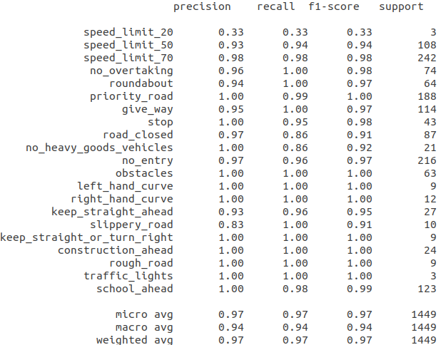
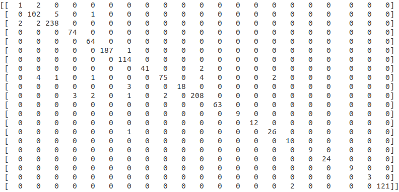
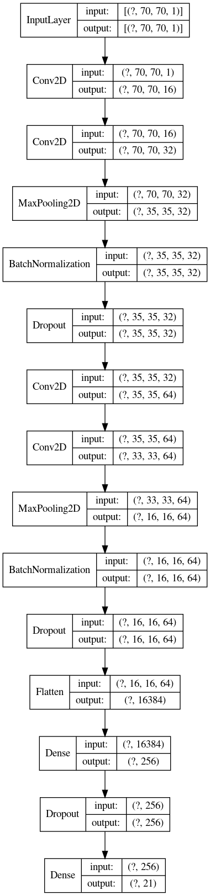

# Traffic signs recognition

CNN architecture and  parameters tuning for a dataset containing ~20k samples partitioned into 21 imbalanced classes.  

Three CNN architectures were implemented. The best one, **Conv2Dsimple2**  has two convolutional layers (followed by maxpooling, batch normalization and 25% dropout respectively) and two fully connected layers (followed by 25% dropout). Achieved weighted accuracy on test set is **97%** for a network with **4.2M** parameters.  

# Test metrics

 

The training script takes into account the imbalance between the cardinality of Belgian samples (3 traffic sign instances per sample) and German samples (30 traffic sign instances per sample) by randomly choosing 3 instances per German sample and taking all 3 instances of the Belgian sample during train time. Augmentations are performed: brightness increase/decrease, zoom in/out, horizontal/vertical shift, rotation. During validation, the three German sample instances are uniformly chosen. This strategy insures balanced training if newer samples from other countries are to be added in future.

  

 
Training data is divided into two main subsets: traffic signs from Belgium and from Germany. Although overall very similar, some traffic signs have small differences such as 'speed limit 20' which has written 'km' on it whereas in Germany that space is left blank. Data from Germany make ~80% of training data. Test set is made of Belgian traffic signs. Reason why the performance is poorest on class 0 - 'speed limit 20' is because it is underrepresented in belgian train set. For example, this is not the issue with class 19 - 'traffic lights' which is also underrepresented in same fashion in Belgian set but this is compensated for in German set as this sign is the same in both countries.

# Confusion matrix on test set

 

  

 

# Conv2Dsimple2 architecture

The neural net has the capacity to distinguish between samples which are visually not similar i.e. belong to different types of traffic signs:

  

However, for class 0 - 'speed limit 20'one can see that it is missclassified for class 2 - 'speed limit 70'. Also some class 2 samples were missed for class 0 (2 to be exact). Surely more Belgian samples of this class need to be added.

# CNN architecture choices and motivation:

*	*Conv2Dnet* contains one convolutional layer with 64 filters. Parameters for filter size were varied from (7,7), (5,5), (3,3) with same stride = 1. Also, input tensor is one channel as color on traffic signs does not define their class which helps in reducing number of parameters in this convolutional layer (making the model better for inference time).  Changing filter size did not influence much the accuracy (which was ~96% for weighted average) so the (3,3) configuration was chosen as it has the smallest amount of parameters (20M). Batch normalization and dropout layers were added which sped up convergence.   

* Second, *Conv2Dsimple* (2.3M parameters) was used in order to determine whether 1D convolution layer followed immediately by 2D convolution layer (convolutional layer with dimensionality reduction, or “network in network” approach) would provide decent results. Also, it used lesser amount of convolutional filters. It had 3% worse accuracy as the previous model.   

*	After that, *Conv2Dsimple2* (4.2M parameters) architecture was built by stacking an another pair of 1D-2D convolutional layers, first having smaller amount of filters and then 64. This showed to outperform the first model both in accuracy (97% weighted average on test) and inference time.   

# Training parameters:

1.	Stratified k-fold training: same percentage of classes in dataset was sampled to train and validation sets.
2.	Regularization (as networks showed signs of overfitting). Dropout values were varied 0.15..0.35 and above using values >0.3 decreases validation accuracies. However, increasing from 0.15 to 0.25 increased validation accuracy in between 1-2%. Setting max norm constraint to 4 increased the accuracy too by ~0.5%.
3.	Batch size was varied between 8 and 16. Bigger batch size had no effect other than slowing the convergence.
4.	Loss function (categorical crossentropy) was modified to penalize 'speed limit 20' class (see confusion matrix) twice and three times as much as other classes and it did not lead to overall increase in precision/recall for this class.
5.	Adam optimizer was used mainly. SGD did not show increase in validation accuracy as opposed to Adam (it was actually ~2% worse), when modifying the initial learning rate (LR), and its decay and when using larger batch size. Setting the minimum value of Adam’s LR to 1e-8, a 50% linear rate decay and 1e-3 as initial value for learning rate showed overall 0.5% increase in validation accuracy and sped up convergence.

# Future work:

1. Increasing Belgian set
2. Decreasing input tensor resolution for better inference time

